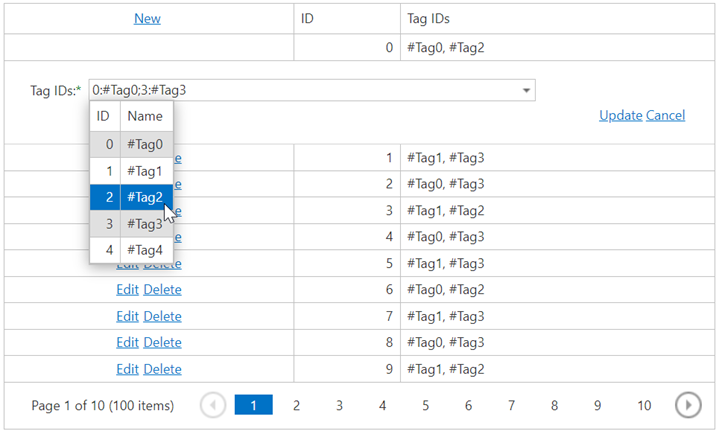

# Grid View for ASP.NET MVC - How to use a grid lookup control in multiple selection mode to edit grid data
<!-- run online -->
**[[Run Online]](https://codecentral.devexpress.com/t328613/)**
<!-- run online end -->

This example demonstrates how to add a grid lookup control in multiple selection mode to the grid's edit form template.



## Overview

The main idea is to use a column's [GridViewColumn.SetEditItemTemplateContent](https://docs.devexpress.com/AspNetMvc/DevExpress.Web.Mvc.MVCxGridViewColumn.SetEditItemTemplateContent.overloads) method to add a grid lookup editor to the edit item template. In this example, the [GridLookupProperties.SelectionMode](https://docs.devexpress.com/AspNet/DevExpress.Web.GridLookupProperties.SelectionMode) property is set to `Multiple`.

```cshtml
settings.Columns.Add(col => {
    col.FieldName = "TagIDs";
    col.SetEditItemTemplateContent(container => {
        Html.RenderAction("GridLookupPartial", new { CurrentID = DataBinder.Eval(container.DataItem, "ID") });
    });
});
```

```cshtml
@Html.DevExpress().GridLookup(settings => {
    settings.Name = "TagIDs";
    settings.Properties.TextFormatString = "{0}:{1}";
    settings.Width = Unit.Pixel(400);
    settings.GridViewProperties.CallbackRouteValues = new { Controller = "Home", Action = "GridLookupPartial", CurrentID = Model.ID };
    <!-- ... -->
    settings.Properties.SelectionMode = GridLookupSelectionMode.Multiple;
}).BindList(ViewData["Tags"]).Bind(Model.TagIDs).GetHtml()
```

To validate edit values on the client side, pass a correct model instance to the PartialView.

```cs
//HomeController.cs
public ActionResult GridLookupPartial(int? CurrentID) {
    ViewData["Tags"] = DataProvider.GetTags();
    GridDataItem model = new GridDataItem() { ID = -1, TagIDs = new int[0] };
    if (CurrentID > -1) {
        model = DataProvider.GetGridData().Where(item => item.ID == CurrentID).FirstOrDefault();
    }
    return PartialView(model);
}
```

## Files to Review

* [HomeController.cs](./CS/Controllers/HomeController.cs) (VB: [HomeController.vb](./VB/Controllers/HomeController.vb))
* [GridLookupPartial.cshtml](./CS/Views/Home/GridLookupPartial.cshtml)
* [GridViewPartial.cshtml](./CS/Views/Home/GridViewPartial.cshtml)

## Documentation

* [DevexpressEditorsBinder - Support binding multiple values selected in MVC editor extensions to a Model's collection-type property](https://supportcenter.devexpress.com/ticket/details/t196024/devexpresseditorsbinder-support-binding-multiple-values-selected-in-mvc-editor)

## More Examples

* [Grid View for ASP.NET MVC - How to use a grid lookup in single selection mode to edit grid data](https://github.com/DevExpress-Examples/asp-net-mvc-grid-use-grid-lookup-in-single-selection-mode-to-edit-data)
* [Grid View for ASP.NET Web Forms - How to use a grid lookup control in multiple selection mode to edit grid data](https://github.com/DevExpress-Examples/asp-net-web-forms-grid-use-grid-lookup-in-multiple-selection-mode-to-edit-data)
* [Grid View for ASP.NET Web Forms - How to use a two-way data-bound grid lookup control to edit grid data](https://github.com/DevExpress-Examples/how-to-use-two-way-data-bound-aspxgridlookup-in-edit-form-of-aspxgridview-to-edit-data-e2979)
